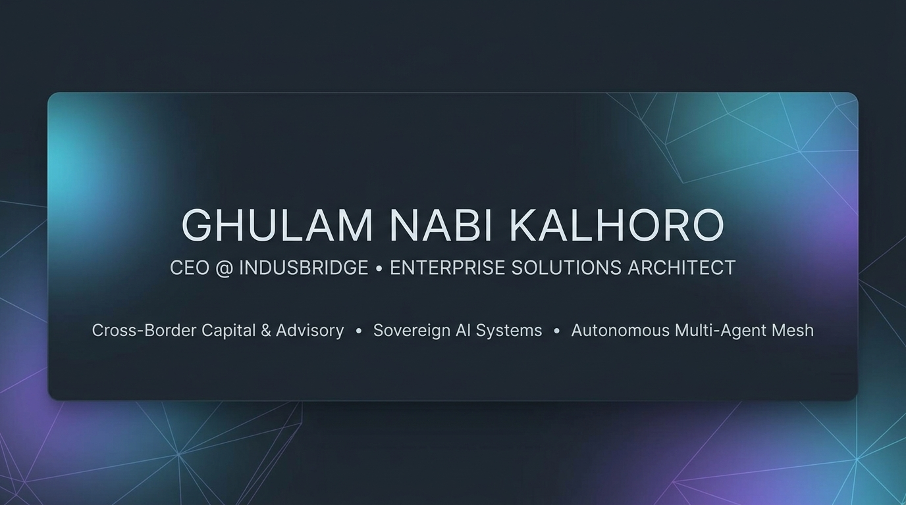
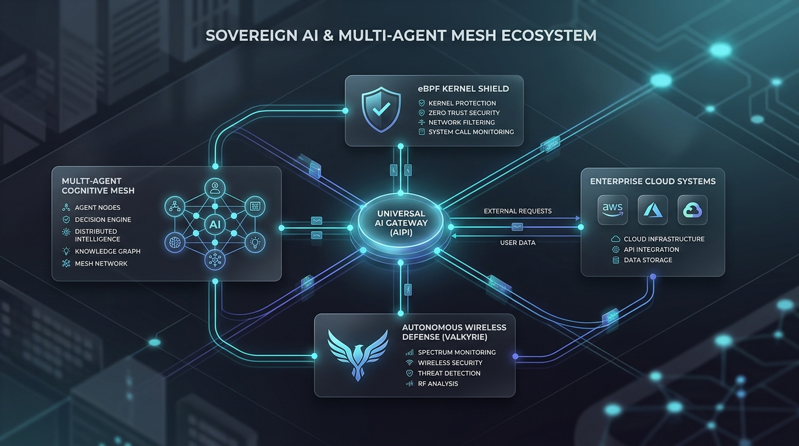

<div align="center">



<br/><br/>

[](https://linkedin.com/in/gnkalhoro)
[](https://linkedin.com/in/gnkalhoro)
[](mailto:mr.gnkalhoro@gmail.com)
[](https://skills.google/public_profiles/e8177aca-655c-4a35-bab7-2fa2678bb698)
[](#)

<br/>

[](https://github.com/gnonymous1)
[](https://github.com/gnonymous1?tab=repositories)
[](https://linkedin.com/in/gnkalhoro)
[](#)

</div>

---

## 🏛️ Executive Dossier

> **"Build controls that actually enforce, not policies that merely document."**

I am the **Chief Executive Officer (CEO) at IndusBridge** and an **Enterprise Solutions Architect** designing high-concurrency cross-border investment platforms and sovereign technical architectures.

My executive and engineering mandate unifies:
* 🌐 **Cross-Border Advisory & Systems ([IndusBridge](https://linkedin.com/in/gnkalhoro)):** Bridging Pakistan, MENA (Dubai Desk: GulfCapital Systems), and Europe across priority economic corridors: **IT & AI · Real Estate · Mines & Minerals · Power & Energy**. Internal AI engines for deal origination, compliance audits, and SIFC strategic alignment.
* 🧠 **Universal AI Protocol Gateways:** High-throughput model routing, smart token preservation, and zero-downtime failover across 189+ LLM providers (`AIPI`).
* 🛡️ **Kernel-Level Infrastructure Defense:** Real-time packet enforcement and prompt-injection firewalls directly in Linux network paths using eBPF & XDP bypass hooks (`sovereign-root-protocol`).
* ⚡ **Autonomous Multi-Agent Systems:** Cognitive wireless security agents, automated vulnerability inspection pipelines, and distributed swarm telemetry (`project-valkyrie`, `pentestgpt-web`).

---

## 🌐 Sovereign AI & Enterprise Ecosystem

<div align="center">



</div>

The architecture connects core operational layers:
1. **Advisory & Deal Sourcing Layer:** IndusBridge Cross-Border Investment Platform & Analytics.
2. **Gateway Layer:** Universal AI Protocol Interface (`AIPI`) routing 189+ model providers.
3. **Security & Kernel Layer:** eBPF/XDP network-level filters & prompt injection shielding (`sovereign-root-protocol`).
4. **Cognitive Agent Layer:** Distributed multi-agent swarms, cognitive wireless defense (`project-valkyrie`), and automated penetration engines (`pentestgpt-web`).

---

## 🚀 Public Projects Portfolio

### 1. 🌐 [AIPI — Universal AI Protocol Interface & Token Gateway](https://github.com/gnonymous1/AIPI)
> **Multi-Model Manager & Smart Token Failover Gateway supporting 189 API providers and 50+ vibe coding agents.**
* **Stack:** Python 3.11+, FastAPI, Antigravity, Multi-LLM Mesh, Async Telemetry
* **Highlights:** Zero-downtime dynamic routing, automatic rate-limit failover, multi-provider token preservation, and native support for Claude, Cursor, Gemini CLI, Windsurf, Cline, Roo Code, and more.
* [](https://github.com/gnonymous1/AIPI) [](https://github.com/gnonymous1/AIPI)

---

### 2. 🛡️ [sovereign-root-protocol](https://github.com/gnonymous1/sovereign-root-protocol)
> **Open-source AI traffic validation & enforcement gateway powered by eBPF/XDP kernel hooks.**
* **Stack:** C (Linux Kernel eBPF/XDP), Python, FastAPI, HAProxy Mesh, mTLS, SHA-256 Ledger
* **Highlights:** Semantic scoring, real-time prompt injection blocking at the network interface layer, tamper-proof audit trails, and micro-segmentation for AI model traffic.
* [](https://github.com/gnonymous1/sovereign-root-protocol)

---

### 3. ⚡ [project-valkyrie](https://github.com/gnonymous1/project-valkyrie)
> **Autonomous AI-cognitive wireless security agent combining Gemini AI with automated packet capture.**
* **Stack:** Python, Google Gemini Multimodal, Kali Linux, PMKID, WPS Analysis, Hacker TUI
* **Highlights:** Autonomous frequency scanning, automated handshake & PMKID telemetry, neural threat modeling, and distributed swarm node communication.
* [](https://github.com/gnonymous1/project-valkyrie)

---

### 4. 🔍 [pentestgpt-web](https://github.com/gnonymous1/pentestgpt-web)
> **LLM-powered automated penetration testing interface with interactive terminal streaming.**
* **Stack:** Python, FastAPI, Kali Linux, Playwright, WebSockets, LLM Agent Runners
* **Highlights:** Hands-free vulnerability assessment, autonomous command verification, live terminal execution streaming, and automated remediation reporting.
* [](https://github.com/gnonymous1/pentestgpt-web)

---

### 5. 🧠 [Agentic_PoC](https://github.com/gnonymous1/Agentic_PoC)
> **Neuro-symbolic agentic dashboard and autonomous conversational clone bot.**
* **Stack:** Python, Streamlit, LiveKit WebRTC, Recall.ai, Gemini Live Multimodal
* **Highlights:** Real-time bidirectional voice/video streaming, persistent memory graphs, stateful agent decision trees, and digital clone avatars.
* [](https://github.com/gnonymous1/Agentic_PoC)

---

### 6. 📡 [WAIFI](https://github.com/gnonymous1/WAIFI)
> **Professional WiFi penetration testing desktop suite with 100+ integrated tools and adapter management.**
* **Stack:** Python, GTK3, Linux Kernel, Aircrack-ng, Monitor Mode Automation
* **Highlights:** One-click monitor mode toggle, automatic packet capture, loot locker credential storage, and hardware adapter diagnostics.
* [](https://github.com/gnonymous1/WAIFI)

---

### 7. 📷 [CameraGPT](https://github.com/gnonymous1/CameraGPT)
> **AI-powered serverless visitor management system with instant facial detection and secure access logging.**
* **Stack:** Netlify Serverless Functions, JavaScript, JWT Authentication, OpenCV
* **Highlights:** Instant browser webcam capture, privacy-first biometric consent verification, and audit-ready visitor logs.
* [](https://github.com/gnonymous1/CameraGPT)

---

### 8. 🤖 [AUTOAI](https://github.com/gnonymous1/AUTOAI)
> **Autonomous multi-agent framework and self-evolving workflow orchestrator.**
* **Stack:** Python, LangChain, Multi-Agent Coordination, Dynamic Prompt Optimization
* **Highlights:** Self-correcting task loops, autonomous tool dispatching, and deterministic execution pipelines.
* [](https://github.com/gnonymous1/AUTOAI)

---

### 9. 📈 [linkedin-growth-lab](https://github.com/gnonymous1/linkedin-growth-lab)
> **Autonomous LinkedIn growth engine, content scheduler, analytics pipeline & AI post copilot.**
* **Stack:** Python, OAuth 2.0, SQLite, Multimodal Content Engine, Rest API
* **Highlights:** Autonomous post scheduling, carousel generation, engagement telemetry, and content repurposing.
* [](https://github.com/gnonymous1/linkedin-growth-lab)

---

### 10. 🏛️ [Gnonymous-Co](https://github.com/gnonymous1/Gnonymous-Co)
> **Enterprise AI architectures, sovereign infrastructure specifications, and cyber blueprints.**
* **Stack:** Enterprise Architecture Blueprints, eBPF Kernel Specs, System Designs
* [](https://github.com/gnonymous1/Gnonymous-Co)

---

## 📊 Complete Project & Venture Matrix

| Project / Venture | Category | Key Tech Stack & Focus | Access |
|:---|:---|:---|:---:|
| **[IndusBridge](https://linkedin.com/in/gnkalhoro)** | Cross-Border Capital & Tech Advisory | Real Estate · IT/AI · Mines & Minerals · Power | `VENTURE` |
| **[AIPI](https://github.com/gnonymous1/AIPI)** | Universal AI Routing & Failover | Python, FastAPI, Antigravity, 189 Providers | `PUBLIC` |
| **[sovereign-root-protocol](https://github.com/gnonymous1/sovereign-root-protocol)** | eBPF/XDP AI Kernel Security | C (Kernel), Python, HAProxy, mTLS | `PUBLIC` |
| **[project-valkyrie](https://github.com/gnonymous1/project-valkyrie)** | AI Wireless Security Agent | Gemini AI, Python, Kali, PMKID | `PUBLIC` |
| **[pentestgpt-web](https://github.com/gnonymous1/pentestgpt-web)** | Automated Pentesting & Terminal | Python, Playwright, Kali Linux | `PUBLIC` |
| **[Agentic_PoC](https://github.com/gnonymous1/Agentic_PoC)** | Neuro-Symbolic Agentic Dashboard | Streamlit, LiveKit WebRTC, Gemini | `PUBLIC` |
| **[WAIFI](https://github.com/gnonymous1/WAIFI)** | Desktop WiFi Penetration Suite | Python, GTK3, Linux Wireless Stack | `PUBLIC` |
| **[CameraGPT](https://github.com/gnonymous1/CameraGPT)** | Serverless Visitor Management | Netlify Serverless, JS, OpenCV | `PUBLIC` |
| **[AUTOAI](https://github.com/gnonymous1/AUTOAI)** | Self-Evolving Multi-Agent Mesh | Python, LangChain, Multi-Agent | `PUBLIC` |
| **[linkedin-growth-lab](https://github.com/gnonymous1/linkedin-growth-lab)** | Growth Engine & AI Copilot | Python, SQLite, OAuth 2.0 | `PUBLIC` |
| **[Gnonymous-Co](https://github.com/gnonymous1/Gnonymous-Co)** | Enterprise AI & Cyber Solutions | Sovereign System Blueprints | `PUBLIC` |

---

## 🛠️ Technical Proficiency Matrix

| Domain | Technologies & Frameworks |
|:---|:---|
| **Executive Leadership & Strategy** | Chief Executive Officer (CEO), Cross-Border Deal Origination, B2G Alignment, Governance |
| **Low-Level & Kernel Engineering** | C, C++, Linux Kernel, eBPF, XDP, Assembly (x86/ARM), WireGuard, mTLS |
| **AI & Agentic Systems** | Multi-Agent Swarms, LangGraph, CrewAI, Gemini Multimodal, PyTorch, pgvector |
| **Backend & Cloud Infrastructure** | Python (FastAPI), Go, TypeScript, PostgreSQL, Redis, Docker, GCP, Azure |
| **Offensive & Defensive Security** | Zero-Trust Architecture, Kali Linux, Reverse Engineering, AST Command Guards, AST Shields |
| **Project & Advisory Standards** | Google Certified Project Management, Scrum, SAFe Agile, Tech Incubation (1,500+ ventures) |

---

## 📜 Verified Credentials & Certifications

- **Google Cloud & AI:** Build AI Agents with Enterprise Databases (2026)
- **Google Cloud & AI:** Innovating with Cloud AI & Cognitive Infrastructure (2026)
- **Google Cloud & AI:** Infrastructure & Application Modernization (2026)
- **Google Cloud & AI:** Generative AI Applications Development & Organizational Transformation (2026)
- **Google Cloud & AI:** Gemini Enterprise Application Development (2026)
- **Google Professional Project Management:** Verified Specialization (2022)
- **Cybersecurity & Systems:** Principles of Cybersecurity & Hardening (2022)
- **Systems Engineering:** C++ Systems Software & Advanced Relational Web Engines (2011–2013)

---

## 📬 Connect & Collaborate

```
[COMMUNICATION_LINK: OPEN]
> Open for strategic cross-border advisory, sovereign AI infrastructure partnerships, and executive collaborations.
```

<div align="center">

[](https://linkedin.com/in/gnkalhoro)
[](mailto:mr.gnkalhoro@gmail.com)
[](https://github.com/gnonymous1)

<br/>

*"Build controls that actually enforce, not policies that merely document."*

</div>